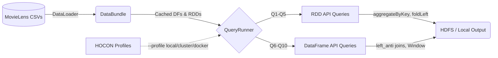

<div align="center">

# Movie Preference Analyzer
**High-performance, configurable analytics on the MovieLens dataset using Apache Spark.**

[](https://www.scala-lang.org/) [](https://spark.apache.org/) [](https://www.scala-sbt.org/) [](https://www.docker.com/) [](https://opensource.org/licenses/MIT)

An Apache Spark distributed processing project developed at the Technical University of Crete (INF424: Functional Programming, Analytics and Applications).

[Architecture](#architecture) • [Features](#features) • [Queries](#queries) • [Getting Started](#getting-started) • [Deployment](#deployment) • [Performance](#performance-optimizations) • [Authors](#authors)

</div>

---

## Overview

This project implements 10 complex analytical queries on the [MovieLens](https://grouplens.org/datasets/movielens/) dataset, showcasing advanced use of both the **Spark RDD API** and **Spark DataFrame API**. The system is built with a pure Functional Programming (FP) approach, eliminating mutable state (`var`), and ensuring thread-safe distributed execution.

It processes high-volume movie ratings and genome relevance scores to extract insights like multi-dimensional skylines, tag sentiment estimation, and reverse nearest-neighbor matching.

## Features

The project is built on **Apache Spark 3.5.4** to provide fault-tolerant, scalable, and memory-efficient data processing. It leverages advanced Spark operations like `aggregateByKey` over `groupByKey`, broadcast variables, and local sorting algorithms for non-dominated (skyline) query optimizations.

A fully containerized infrastructure allows for one-command deployment using Docker Compose to orchestrate a standalone mode or a full Spark Cluster (Master + Workers). 

Configuration is externalized using **HOCON** (Typesafe Config), enabling seamless transitions between local testing, cluster deployment (e.g., TUC SoftNet YARN), and Docker environments without altering the codebase.

## Architecture



## Repository Structure

```text
.
├── docker-compose.yml          # Containerized Spark cluster & standalone execution
├── Dockerfile                  # Multi-stage build (SBT -> Spark runtime)
├── Makefile                    # Automation for data download, building, and running
├── src/main/scala/movieanalyzer/
│   ├── Main.scala              # Entry point — CLI parsing, query orchestration
│   ├── config/                 # HOCON config loader & SparkSessionFactory
│   ├── io/                     # Unified CSV ingestion (DataLoader) & ResultWriter
│   └── queries/                
│       ├── QueryRunner.scala   # Pure FP query dispatch with dependency threading
│       ├── rdd/                # RDD-based queries (Q1–Q5)
│       └── dataframe/          # DataFrame-based queries (Q6–Q10)
├── src/main/resources/         # application.conf, local.conf, cluster.conf, docker.conf
├── docs/                       # Project documentation & original report
└── legacy/                     # Original monolithic procedural Scala scripts
```

---

## Queries

The analysis is broken down into 10 distinct queries, split evenly between RDD and DataFrame APIs.

| # | Name | API | Description |
|:--|:-----|:----|:------------|
| **1** | Iceberg — Top Tags by Genre | RDD | Genre-tag pairs in 100+ movies with avg rating > 4.0 |
| **2** | Tag Dominance per Genre | RDD | Most-used tag per genre with its average rating |
| **3** | Popular & Relevant Tags | RDD | Tags in 100+ movies with avg genome relevance > 0.8 |
| **4** | Sentiment Estimation | RDD | Average user rating per user-assigned tag |
| **5** | Multi-Iceberg Skyline | RDD | Non-dominated (genre, tag) pairs by avg rating × user count |
| **6** | Skyline — Non-Dominated Movies | DataFrame | Movies not dominated in rating, count, and relevance |
| **7** | Correlation Analysis | DataFrame | Pearson correlation: tag relevance vs user ratings |
| **8** | Reverse Nearest Neighbor | DataFrame | Users matched to a target movie via cosine similarity |
| **9** | Tag-Relevance Anomaly | DataFrame | Overhyped but low-rated movies |
| **10** | Reverse Top-K Neighborhood | DataFrame | Top-K users closest to target movie's tag profile |

---

## Getting Started

### Prerequisites

Ensure you have the following installed on your system:
- **Docker** and **Docker Compose** (Recommended)
- OR **Java 11/17** and **SBT 1.9+** (For local native execution)

### 1. Download Dataset

Download the [MovieLens `ml-latest.zip`](https://files.grouplens.org/datasets/movielens/ml-latest.zip) dataset and extract it to the `data/` directory. If you have `make` installed:

```bash
make download-data
```

---

## Deployment

### Option A: Docker (No Spark/SBT Install Required)

The project includes a complete Docker ecosystem for effortless execution.

```bash
# Run all queries in standalone (single container) mode
make run

# Run a specific query
make run-query Q=5

# Run on a distributed Spark cluster (Master + 2 Workers)
make cluster
```
*(Web UI for the cluster is available at [http://localhost:8080](http://localhost:8080))*

If you do not have `make`, you can use `docker compose` directly:
```bash
docker compose --profile standalone up --build
```

### Option B: Local Mode (SBT)

To run natively using SBT and a local Spark installation:

```bash
# Run all queries locally
sbt "run --profile local --query all"

# Run specific queries
sbt "run --profile local --query 1,5,8"
```

### Option C: Cluster Mode (TUC SoftNet YARN)

To deploy to a Hadoop YARN cluster:

```bash
# Build the fat JAR
sbt assembly

# Submit to YARN
spark-submit \
  --master yarn \
  --deploy-mode cluster \
  target/scala-2.12/movie-preference-analyzer-assembly-1.0.0.jar \
  --profile cluster --query all
```

---

## Performance Optimizations

| Optimization | Before | After | Impact |
|:-------------|:-------|:------|:-------|
| `groupByKey` → `aggregateByKey` | All values shuffled to single executor | Map-side combine, `O(1)` memory per key | ~3x faster on large datasets |
| `cartesian` → Sorted-scan skyline | `O(N²)` distributed shuffle | `O(N log N)` local (after `.collect()` on small filtered set) | From minutes to milliseconds |
| Strategic `.cache()` | Re-computed from disk on every query | In-memory after first computation | Avoids redundant I/O + shuffles |
| Immutable Dependency Injection | `var` reassignments across iterations | `foldLeft` threading states pure functionally | Zero mutation, inherently thread-safe |

---

## Configuration

All parameters, query thresholds, and deployment paths are externalized via [HOCON](https://github.com/lightbend/config) (Typesafe Config):

- [`application.conf`](src/main/resources/application.conf) — Base defaults and query thresholds (e.g., target movie ID, top-K).
- [`local.conf`](src/main/resources/local.conf) — Uses `local[*]` and localhost paths.
- [`cluster.conf`](src/main/resources/cluster.conf) — Configured for YARN and HDFS endpoints.
- [`docker.conf`](src/main/resources/docker.conf) — Mapped for container volume mounts (`/data`, `/output`).

---

## License

This project is licensed under the MIT License. See the [LICENSE](LICENSE) file for more details.

---

## Authors

| [<br /><sub><b>Asterinos1</b></sub>](https://github.com/Asterinos1) | [<br /><sub><b>eNiaro</b></sub>](https://github.com/eNiaro) |
| :---: | :---: |

Developed for INF424: Functional Programming, Analytics and Applications at the Technical University of Crete.
